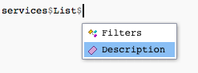

```{css, echo=FALSE}
pre code {
  white-space: pre-wrap;
}
```

# See what services the API offers

Be sure to load the package before starting! 

```{r}
library(epair)
```

```{r echo = FALSE, message = FALSE}
library(httr)
library(jsonlite)
```

At the outset, we may not know exactly what we want from the API. We can start by taking a look at the `services` object included with the package. The `services` object is an R list that contains information about each service offered by the EPA API and how to use it.

If we just want to see a list of services offered, we can try
```{r}
names(services)
```

If we want to see a description for a particular service, we may type its name and select it from `services`. 

An example for the `MetaData` service is shown below.
```{r }
services[["MetaData"]]$Description
```
Using RStudio's smart variable selection, simply typing `services$` will open up a service to select along with any other useful information about that service. 


Becoming familiar with the `services` object can help you to make calls.
In the [Navigating services](../../Useful-Features/Services) page, we talk in depth about the `services` object.  

# A basic call

In this example, we will attempt to list all parameter codes associated with states in the US. 

### Setup

If you haven't already read the Anatomy of an API request, we recommend you do. The post explains how a call is made and may help you in making your own calls. 

Remember to set up your authentication first!

The package automatically includes the base of the call (the base API site and authentication). To query, we need to find the appropriate `get` function for our service, or manually provide an endpoint to `perform.call()` (to see how you can determine an endpoint see the [Finding endpoints](../../Useful-Features/Endpoints) page). 

### Option 1: User friendly functions

To reduce the difficulty of finding the specific endpoint for your API call, there are a collection of specific `get` functions for each service and filter combination.

If we were trying to find state parameter codes, this will return all states and their respective FIPS codes.

```{r, eval=FALSE}
result <- get_state_fips()
```

The `get` function for each service will provide an R list with a `Header` and `Data` component. The `Header` contains information about the call and is useful for determining how the call went through. 

```{r, eval=FALSE}
result$Header$status
result$Header$request_time
```

To get the actual data we called for (states and their parameter codes), we use the `Data` component of the result.

```{r, eval=FALSE}
result$Data
```

### Option 2: Manually placing the call

If we want to make the call manually, we need to determine the appropriate endpoint for the type of query we wish to make.

Recall that we're looking for all parameter codes associated with each state in the US.

We first look at `services`, and select `List`'s description to see if this is the appropriate service to use. 



```{r}
services$List$Description
```
This seems like the perfect service to use to find state parameter codes. We select `List`, and then see that there are multiple `Filters` available for listing. 


It looks like `States` would be the most appropriate option here.

```{r}
services$List$Filters$States
```
This shows us the endpoint to use and required variables. Since the `email` and `key` are always included in calls, we need only get the endpoint to make the call.

```{r}
endpoint <- services$List$Filters$States$Endpoint
```

After determining the endpoint, we can make the call using `perform.call()`.

```{r, eval=FALSE}
result <- perform.call(endpoint = endpoint)
```
The `perform.call()` function will provide the same R list structure for output as each of the `get` functions.

Alternatively, if you want the original output from the API, `perform.call.raw()` will make a request, and provide the request results raw in JSON format. 

```{r, eval=FALSE}
raw.result <- perform.call.raw(endpoint = endpoint)
```
