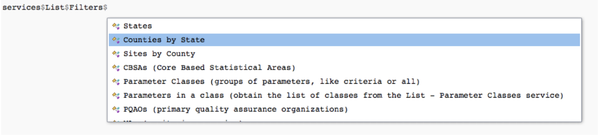

```{r echo = FALSE}
library(epair)
```

```{r echo = FALSE, message = FALSE}
library(httr)
library(jsonlite)
```

Some calls require additional API variables like the state or county of interest. For these calls, we can easily add variables to the base call by passing them in as arguments to a `get` function, or as a second argument to `perform.call()`.

# Option 1: User friendly functions
## Adding a single variable

To start off, suppose we want to find out what counties and respective parameter codes exist for North Carolina. 
We can again use the `services` object, and check its `List` service as in [Making your first call](../../docs/Tutorial/making-your-first-call).



It looks like the `Counties by state` filter would be appropriate since we're trying to determine the county parameter codes for North Carolina.

This specific service and filter can be done through `get_counties_in_state()`. Each `get` function has defined arguments for each required and optional variable. All of these functions and the documentation on variables for each are available in the [Reference](../../Reference) page. We can add each of these variables by passing them as arguments through the user friendly functions.

Notice we have a required variable `state.fips`. Since we're looking for counties in North Carolina, we can use the parameter code for North Carolina as the entry for `state`. We were able to determine all parameter codes for states in [Making your first call](../../docs/Tutorial/making-your-first-call) so we look at our output there and find that the parameter code for North Carolina is `37`.

For our example, once we know our specific state code for North Carolina, all we have to do is pass it as an argument in the corresponding function.

```{r, eval=FALSE}
result <- get_counties_in_state(state.fips = '37')
```

## Adding multiple variables

Similar to single variables, our higher level functions will require parameters for the service of our choice.

Suppose, for instance, we're interested in finding daily ozone data for North Carolina, starting January 1, 2020 and ending on January 2, 2020, and we have determined the correct parameter codes for each API variable (please see [Navigating API services](../Useful-Features/Services) or [Figuring out API variables](../../docs/Useful-Features/Variables) to understand how we could go about determining proper parameter codes for each of these variables).

```{r, eval=FALSE}
result <- get_daily_summary_in_state(bdate = '20200101', 
                                     edate = '20200102',
                                     state.fips = '37',
                                     param = '44201')
```

# Option 2: Manually placing the call
## Adding a single variable 

Similar to before, we can also go about placing the call through another method by manually finding the endpoint. From before, we can locate the endpoint through the `services` object, check its `List` service, and select the filter we are looking for.

```{r}
services$List$Filters$`Counties by State`
```

Now, we can perform the call by putting together the endpoint for listing counties by state and the particular state we're interested.

```{r eval = FALSE}
endpoint <- services$List$Filters$`Counties by State`$Endpoint
state.code <- '37'
result <- perform.call(endpoint = endpoint, variables = state.code, name = "state")
```

Note that we specified the additional variables we'd be adding with `variables = state.code`, and we inserted the API variable name as `name = state` in the function. An alternative is to simply declare the parameter code with the API variable name as follows.

```{r eval = FALSE}
endpoint <- services$List$Filters$`Counties by State`$Endpoint
state <- '37'
result <- perform.call(endpoint = endpoint, variables = state)
```

## Adding multiple variables 

In the case of multiple variables, we can make a list of variables and pass the list into `perform.call()` as the second argument. 

From before, we’re interested in finding daily ozone data for North Carolina, starting January 1, 2020 and ending on January 2, 2020, and we have determined the correct parameter codes for each API variable.

For this, we create a list that has the appropriate API variable names declared for parameter codes.
```{r eval = FALSE}
endpoint <- 'dailyData/byState'
variable.list <- list("state" = '37', 
                      "bdate" = '20200101', 
                      "edate" = '20200102', 
                      "param" = '44201')
result <- perform.call(endpoint = endpoint, variables = variable.list)
```

# Caching a call

Calling the same large dataset frequently can take time to load each time, but we can cache this data by storing it in the user's specified directory for convenience. In each `get` function and `perform.call()` we can specify as an argument whether the call is cached or not and the directory the call is saved in.

For example, if we plan to use the daily ozone data for North Carolina from January 1, 2020 to March 1, 2020 many times over, we can specify we want to cache this data in user friendly functions.

```{r eval = FALSE}
result <- get_daily_summary_in_state(bdate = '20200101', 
                                     edate = '20200102',
                                     state.fips = '37',
                                     param = '44201',
                                     cached = TRUE,
                                     cache_directory = "~/epair/cache")

```


Or similarly, cache this data using the endpoint method.

```{r eval = FALSE}
endpoint <- 'dailyData/byState'
variable.list <- list("state" = '37', 
                      "bdate" = '20200101', 
                      "edate" = '20200301', 
                      "param" = '44201')
result <- perform.call(endpoint = endpoint, 
                       variables = variable.list, 
                       cached = TRUE, 
                       cache_directory = "~/epair/cache")
```

Without specification of these arguments, the `get` and `perform.call()` functions default will always cache the call in the directory "~/epair/cache" based in the current working directory.
