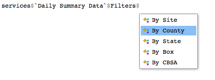
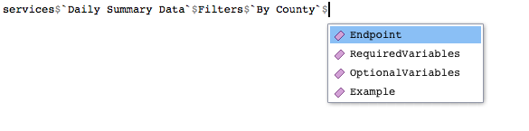

```{r echo = FALSE, message = FALSE}
library(jsonlite)
library(httr)
library(epair)
```

Let's take a look at how to find endpoints for making queries (see [Anatomy of an EPA API request](../../Tutorial/anatomyEPArequest) if you don't know what an endpoint is). 

## Simple listing
The `endpoints` object comes loaded with `epair`. `endpoints` is a vector that provides all EPA API endpoints in use. You can see these by calling `endpoints`. 

```{r}
endpoints
```
You could "manually" find a particular endpoint by looking for similarities with an API service and its endpoint name. For example, to get annual data for a state, it's easy to see that `annualData/byState` is the right endpoint to use. 

## Using the services object

Visually sifting through endpoints can be confusing so another approach is through the `services` object. If you know what API service you want to use, finding the corresponding endpoint is straightforward. 

For example, let's suppose you want to get daily summary data for a particular county. Then, using the `services` object we can see the endpoint as follows.

Select `Daily Summary Data` from `services`.


Then select the appropriate filter, in this case, `By County`.



Then, select `Endpoint`.




```{r}
services$`Daily Summary Data`$Filters$`By County`$Endpoint
```
In fact, all endpoints for a service can be found using this general template. 

```{r eval = FALSE}
 services$ServiceName$Filters$SpecificFilter$Endpoint
```

